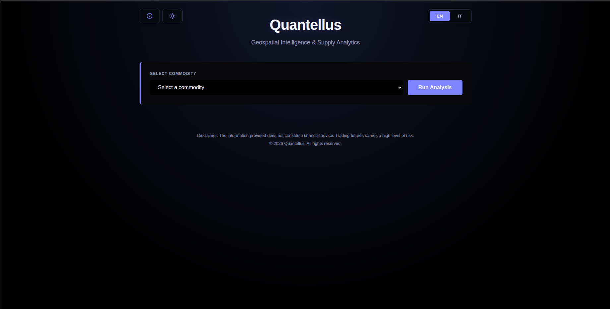
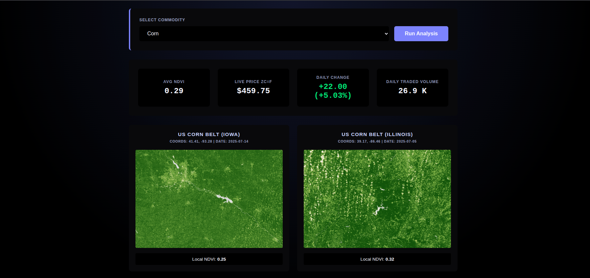
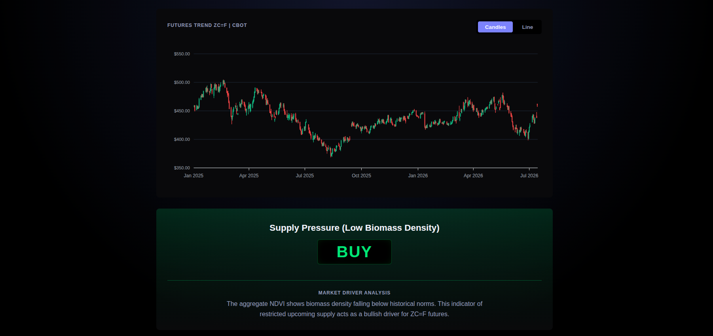

<h1>🛰️ Quantellus <small> - Geospatial Intelligence & Supply Analytics</small></h1>

Quantellus is an educational portfolio project built around an **algorithmic trading signal generator**. The idea is simple: take raw agricultural satellite imagery and turn it into something a trader could actually use — a market signal.

> **Note:** This is strictly a portfolio project for educational purposes — the satellite `.tiff` raster data used here are static historical samples from 2025, nothing live.

The application tracks NDVI (Normalized Difference Vegetation Index) across a handful of strategic agricultural basins worldwide, turns that into quantitative indicators of physical supply, and lines them up against real-time futures prices on the CBOT exchange.

## Theoretical Background & Methodology

Crop health and biomass density are measured here through the **Normalized Difference Vegetation Index (NDVI)**. The index plays on how two bands of the electromagnetic spectrum behave differently over vegetation: visible red light gets absorbed by chlorophyll, while near-infrared light bounces strongly off the mesophyll structure inside leaves.

The standard formula for NDVI is defined as:

$$ NDVI = \frac{NIR - Red}{NIR + Red} $$

Where:
*   $NIR$ = Near-Infrared reflectance
*   $Red$ = Visible Red reflectance

### Spatial Averaging

The application works from raw `.tiff` raster files that already contain pre-calculated NDVI values. For any given region $R$, it computes a local average NDVI after stripping out invalid pixels — `NaN` values, or anything falling outside the theoretical $[-1, 1]$ range:

$$ \overline{NDVI}_{R} = \frac{1}{N} \sum_{i=1}^{N} NDVI_i \quad \forall \, NDVI_i \in [-1, 1] $$

$N$ here is simply the number of valid pixels in that region's raster.

To arrive at an aggregate supply outlook for a given commodity — wheat, corn, soybeans — the system takes an unweighted mean across $M$ strategic regions:

$$ \overline{NDVI}_{global} = \frac{1}{M} \sum_{j=1}^{M} \overline{NDVI}_{R_j} $$

## How It Works

* **1 - Geospatial Processing:** The backend ingests historical raster datasets derived from Copernicus satellite observations using `tifffile` and `numpy`, then parses, filters, and reduces the data down to a set of quantitative local indices.
* **2 - Financial Correlation:** The `yfinance` API pulls live historical data for the matching commodity futures on the CBOT exchange — `ZW=F` for wheat, `ZC=F` for corn, and so on.
* **3 - Algorithmic Signaling:** The aggregate $\overline{NDVI}_{global}$ gets compared against a predefined historical baseline, or pivot. Lower-than-average NDVI points to a potential supply constraint — a bullish signal — while higher NDVI suggests a biomass surplus, which reads as bearish.

## 🚀 How to Run Locally

To test the application on your local machine, follow these steps:

1. **Clone the repository:**

```bash
   git clone https://github.com/g-projectech/quantellus.git
   cd quantellus
```

2. **Create and activate a virtual environment:**

   Create and activate a virtual environment:
   This keeps the project dependencies isolated from your system.

   On Windows:

```bash
   python -m venv venv
   venv\Scripts\activate
```

   On macOS / Linux:

```bash
   python3 -m venv venv
   source venv/bin/activate
```

3. **Install the dependencies:**

```bash
   pip install -r requirements.txt
```

4. **Start the FastAPI server:**
```bash
   uvicorn src.main:app --host 127.0.0.1 --port 8081 --reload
```
 
  🔒 **Security note — `127.0.0.1` vs `0.0.0.0`:**
  - `--host 127.0.0.1` (default here) binds the server to **localhost only**: it's reachable exclusively from your own machine. This is the safer default, especially on shared or public networks.
  - `--host 0.0.0.0` binds the server to **all network interfaces**, making it reachable from any other device on the same network (e.g. to test from your phone or another computer on the same Wi-Fi). Only use this on networks you trust, since it exposes the app — including the `--reload` dev server — to anyone on that network.

  ℹ️ **Port:** `8081` is just the default used in this guide — you can replace `--port 8081` with any free port on your machine, as long as you update the URL in the next step accordingly.

5. **Open the dashboard:**

   Navigate to http://localhost:8081 or http://127.0.0.1:8081 in your browser.

## Geospatial Data Sources

For transparency and reproducibility, all the static raster data in this project comes straight from the **Copernicus Data Space Ecosystem**. Below are the exact coordinates, acquisition dates, and direct links to the satellite imagery behind each NDVI computation:

<table border="1">
  <thead>
    <tr>
      <th align="left">Commodity</th>
      <th align="left">Region</th>
      <th align="left">Coordinates (Lat, Lng)</th>
      <th align="left">Date</th>
      <th align="left">Copernicus Link</th>
    </tr>
  </thead>
  <tbody>
    <tr>
      <td><b>Wheat</b></td>
      <td>Black Sea Basin (Odesa)</td>
      <td><code>46.68, 30.66</code></td>
      <td>2025-06-20</td>
      <td><a href="https://browser.dataspace.copernicus.eu/?zoom=10&lat=46.68289&lng=30.66284&themeId=DEFAULT-THEME&visualizationUrl=U2FsdGVkX1%2BjgCBp7p9vy1s1S21M50N5mpYoZ%2Ba09Sv1E22KBBDMcsGUEHqvcORijGgVnUieNE%2FtSV6r0xPxIbj9oScZspruBD%2Bu5WIuddI%2FdtSp1vctgcifawcaomaO&datasetId=S2_L1C_CDAS&fromTime=2025-06-20T00%3A00%3A00.000Z&toTime=2025-06-20T23%3A59%3A59.999Z&layerId=3_NDVI&demSource3D=%22MAPZEN%22&cloudCoverage=30&dateMode=SINGLE">View Imagery</a></td>
    </tr>
    <tr>
      <td><b>Wheat</b></td>
      <td>Northern Plains (ND, USA)</td>
      <td><code>48.50, -102.01</code></td>
      <td>2025-07-09</td>
      <td><a href="https://browser.dataspace.copernicus.eu/?zoom=10&lat=48.50341&lng=-102.01149&themeId=DEFAULT-THEME&visualizationUrl=U2FsdGVkX1%2B6wI4AsZTWjRLxwhGfCs1y39g08%2F1ZSDcF7vfq8uCGK92nJIQQUUWFQ9TxQZAVZUD%2Bfci6X0TXcbO0f3TtWtjuYJOJUcTvskD5SWHoYDBshbHEDbZLoOnv&datasetId=S2_L2A_CDAS&fromTime=2025-07-09T00%3A00%3A00.000Z&toTime=2025-07-09T23%3A59%3A59.999Z&layerId=3_NDVI&demSource3D=%22MAPZEN%22&cloudCoverage=10&dateMode=SINGLE">View Imagery</a></td>
    </tr>
    <tr>
      <td><b>Corn</b></td>
      <td>US Corn Belt (Iowa)</td>
      <td><code>41.41, -93.28</code></td>
      <td>2025-07-14</td>
      <td><a href="https://browser.dataspace.copernicus.eu/?zoom=10&lat=41.40823&lng=-93.28217&themeId=DEFAULT-THEME&visualizationUrl=U2FsdGVkX18g6RIUq%2BEykFkkbJW7fYdsdqdd2v5kZAICqqlrXWtLDzOVN9EZ9wLzxAzOiUH57tGTRX6%2FEkGzFE1%2FaVXj%2BgYjdPlzuN55yZQ03ZQcbbmolPmNOvM5pHPq&datasetId=S2_L1C_CDAS&fromTime=2025-07-14T00%3A00%3A00.000Z&toTime=2025-07-14T23%3A59%3A59.999Z&layerId=3_NDVI&demSource3D=%22MAPZEN%22&cloudCoverage=10&dateMode=SINGLE">View Imagery</a></td>
    </tr>
    <tr>
      <td><b>Corn</b></td>
      <td>US Corn Belt (Illinois)</td>
      <td><code>39.17, -86.46</code></td>
      <td>2025-07-05</td>
      <td><a href="https://browser.dataspace.copernicus.eu/?zoom=10&lat=39.16574&lng=-86.46034&themeId=DEFAULT-THEME&visualizationUrl=U2FsdGVkX18jwiKueLXi%2F%2BGlFlOR7twS4dSxtVDIMO29Myo1OckqAsWEXMXWzwDL8Tf%2FwyZBz1z%2Biu7BU9PmV0Sd%2BqGNdtWPXSgCOJ81mc12fQ9BC8UbXLZWx7hXewwT&datasetId=S2_L2A_CDAS&fromTime=2025-07-05T00%3A00%3A00.000Z&toTime=2025-07-05T23%3A59%3A59.999Z&layerId=3_NDVI&demSource3D=%22MAPZEN%22&cloudCoverage=10&dateMode=SINGLE">View Imagery</a></td>
    </tr>
    <tr>
      <td><b>Soybeans</b></td>
      <td>Mato Grosso (Brazil)</td>
      <td><code>-12.63, -56.20</code></td>
      <td>2025-02-09</td>
      <td><a href="https://browser.dataspace.copernicus.eu/?zoom=10&lat=-12.62895&lng=-56.19507&themeId=DEFAULT-THEME&visualizationUrl=U2FsdGVkX1%2FZyrmf4AiSWLQJKVV40LQirU%2F1YpgoMXyUrba6koFmEZFMdrTXifag0YmK%2Fa5QbVKQXItGSe2tG6iT%2FM1JqMRa7YLWqYw9LbrwIKTtfj%2B2WyJjlkDnnSXy&datasetId=S2_L1C_CDAS&fromTime=2025-02-09T00%3A00%3A00.000Z&toTime=2025-02-09T23%3A59%3A59.999Z&layerId=3_NDVI&demSource3D=%22MAPZEN%22&cloudCoverage=10&dateMode=SINGLE">View Imagery</a></td>
    </tr>
    <tr>
      <td><b>Soybeans</b></td>
      <td>Rosario Area (Argentina)</td>
      <td><code>-33.85, -60.74</code></td>
      <td>2025-02-19</td>
      <td><a href="https://browser.dataspace.copernicus.eu/?zoom=10&lat=-33.8459&lng=-60.73723&themeId=DEFAULT-THEME&visualizationUrl=U2FsdGVkX18gS8SuUZB6JKRknrFGB9nykPSn%2FIh5NlQHEo14vvQZvb%2Bqte4WrjJQ%2FZjmvhDXtVQLe37mLukJRl7SlUZDFzpo9acjmHM7zznLRAcNxcY2TpD4ZlOapuFl&datasetId=S2_L2A_CDAS&fromTime=2025-02-19T00%3A00%3A00.000Z&toTime=2025-02-19T23%3A59%3A59.999Z&layerId=3_NDVI&demSource3D=%22MAPZEN%22&cloudCoverage=10&dateMode=SINGLE">View Imagery</a></td>
    </tr>
  </tbody>
</table>

## Web Interface


*Figure 1: Dashboard overview, with the interactive commodity selector.*

* **Bilingual Interface:** The application supports both English and Italian, plus a Dark/Light mode switcher.


*Figure 2: Satellite imagery across multiple regions, with local NDVI computed for each.*


*Figure 3: Live futures charts alongside macro driver signals.*

* **Market Integration:** Futures charting is built with `ApexCharts` and lets users overlay technical financial data on top of the fundamental geospatial metrics.

## Disclaimer

Quantellus is a portfolio project, built strictly for educational and academic purposes. Nothing here constitutes financial, investment, or trading advice. Futures trading carries substantial risk, and this tool isn't meant to replace professional, commercial-grade predictive tools.

## License

© 2026 Quantellus. All Rights Reserved. See the [LICENSE](LICENSE).